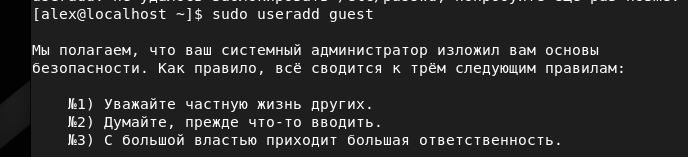
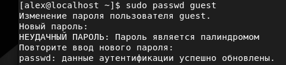
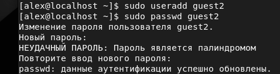
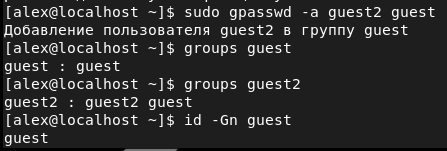
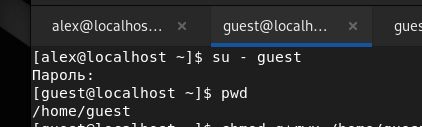
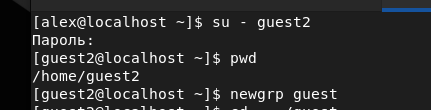
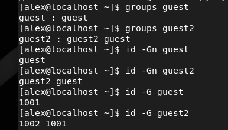
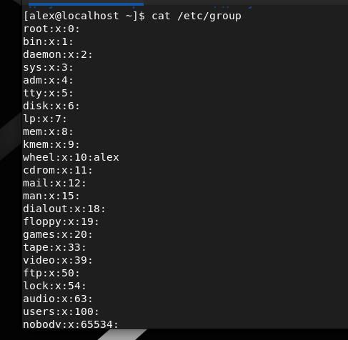
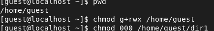

---
# Front matter
lang: ru-RU
title: "Лабораторная работа 3"
subtitle: "Дискреционный подход разграничения прав пользователей по группам"
author: "Сырцов Александр Юрьевич"

# Formatting
toc-title: "Содержание"
toc: true # Table of contents
toc_depth: 2
lof: true # List of figures
lot: true # List of tables
fontsize: 12pt
linestretch: 1.5
papersize: a4paper
documentclass: scrreprt
polyglossia-lang: russian
polyglossia-otherlangs: english
mainfont: PT Serif
romanfont: PT Serif
sansfont: PT Sans
monofont: PT Mono
mainfontoptions: Ligatures=TeX
romanfontoptions: Ligatures=TeX
sansfontoptions: Ligatures=TeX,Scale=MatchLowercase
monofontoptions: Scale=MatchLowercase
indent: true
pdf-engine: lualatex
header-includes:
  - \linepenalty=10 # the penalty added to the badness of each line within a paragraph (no associated penalty node) Increasing the value makes tex try to have fewer lines in the paragraph.
  - \interlinepenalty=0 # value of the penalty (node) added after each line of a paragraph.
  - \hyphenpenalty=50 # the penalty for line breaking at an automatically inserted hyphen
  - \exhyphenpenalty=50 # the penalty for line breaking at an explicit hyphen
  - \binoppenalty=700 # the penalty for breaking a line at a binary operator
  - \relpenalty=500 # the penalty for breaking a line at a relation
  - \clubpenalty=150 # extra penalty for breaking after first line of a paragraph
  - \widowpenalty=150 # extra penalty for breaking before last line of a paragraph
  - \displaywidowpenalty=50 # extra penalty for breaking before last line before a display math
  - \brokenpenalty=100 # extra penalty for page breaking after a hyphenated line
  - \predisplaypenalty=10000 # penalty for breaking before a display
  - \postdisplaypenalty=0 # penalty for breaking after a display
  - \floatingpenalty = 20000 # penalty for splitting an insertion (can only be split footnote in standard LaTeX)
  - \raggedbottom # or \flushbottom
  - \usepackage{float} # keep figures where there are in the text
  - \floatplacement{figure}{H} # keep figures where there are in the text
---

# Цель работы

Получение практических навыков работы в консоли с атрибутами файлов для групп пользователей.

# Задание

Выполнить все указанные действия для разграничения прав пользователей и заполнить таблицу.

# Выполнение лабораторной работы

1. В установленной операционной системе создайте учётную запись пользователя guest (использую учётную запись администратора):
useradd guest (рис. -@fig:001).

{ #fig:001 width=70% }

2. Задайте пароль для пользователя guest (использую учётную запись администратора):
passwd guest(рис. -@fig:002).

{ #fig:002 width=70% }

3. Аналогично создайте второго пользователя guest2 (рис. -@fig:003).

{ #fig:003 width=70% }

4. Добавьте пользователя guest2 в группу guest:
gpasswd -a guest2 guest (рис. -@fig:004).

{ #fig:004 width=70% }

5. Осуществите вход в систему от двух пользователей на двух разных консолях: guest на первой консоли и guest2 на второй консоли (рис. -@fig:005) (рис. -@fig:006).

{ #fig:005 width=70% }

{ #fig:006 width=70% }

6. Для обоих пользователей командой pwd определите директорию, в которой вы находитесь. Сравните её с приглашениями командной строки.

Оба пользователя имеют директории в `/home/`, отличаются лишь сами директории по названию пользователей.

7. Уточните имя вашего пользователя, его группу, кто входит в неё
и к каким группам принадлежит он сам. Определите командами
groups guest и groups guest2, в какие группы входят пользователи guest и guest2. Сравните вывод команды groups с выводом команд
id -Gn и id -G (рис. -@fig:007).

{ #fig:007 width=70% }

Видно, что `groups <user>` показывает лишь словарь из членов группы, в то время как `id <key> <user>` выдаёт сами значения в разных форматах.

8. Сравните полученную информацию с содержимым файла /etc/group (рис. -@fig:008).
Просмотрите файл командой
cat /etc/group

{ #fig:008 width=70% }

9. От имени пользователя guest2 выполните регистрацию пользователя
guest2 в группе guest командой
newgrp guest (рис. -@fig:009).

{ #fig:009 width=70% }

10. От имени пользователя guest измените права директории /home/guest,
разрешив все действия для пользователей группы:
chmod g+rwx /home/guest (рис. -@fig:010).

{ #fig:010 width=70% }

Минимальные права для совершения операций от имени пользователей
входящих в группу
---
|Права директории|Права файла|Создание файла|Удаление файла|Запись в файл|Чтение файла|Смена директории|Просмотр файлов в директории|Переименование файла|Смена атрибутов файла|
|----------------|-----------|--------------| -------------|-------------|------------|----------------|----------------------------|--------------------|---------------------|
|(000)           |(000)      |-             |-             |-            |-           |-               |-                           |-                   |-                    |
|(010)           |(000)      |-             |-             |-            |-           |+               |-                           |-                   |+                    |
|(020)           |(000)      |-             |-             |-            |-           |-               |-                           |-                   |-                    |
|(030)           |(000)      |+             |+             |-            |-           |+               |-                           |+                   |+                    |
|(040)           |(000)      |-             |-             |-            |-           |-               |+                           |-                   |-                    |
|(050)           |(000)      |+             |-             |-            |-           |+               |+                           |-                   |-                    |
|(060)           |(000)      |-             |-             |-            |-           |-               |+                           |-                   |-                    |
|(070)           |(000)      |+             |+             |-            |-           |+               |+                           |-                   |-                    |
|(000)           |(010)      |-             |-             |-            |-           |-               |-                           |-                   |-                    |
|(010)           |(010)      |-             |-             |-            |-           |+               |-                           |-                   |-                    |
|(020)           |(010)      |-             |-             |-            |-           |-               |-                           |-                   |-                    |
|(030)           |(010)      |+             |-             |+            |-           |+               |-                           |-                   |+                    |
|(040)           |(010)      |-             |-             |-            |-           |-               |+                           |-                   |-                    |
|(050)           |(010)      |-             |-             |-            |-           |+               |+                           |-                   |-                    |
|(060)           |(010)      |-             |-             |-            |-           |-               |-                           |-                   |-                    |
|(070)           |(010)      |+             |+             |-            |-           |+               |+                           |+                   |+                    |
|(000)           |(020)      |-             |-             |-            |-           |-               |-                           |-                   |-                    |
|(010)           |(020)      |-             |-             |+            |-           |-               |+                           |-                   |-                    |
|(020)           |(020)      |-             |-             |-            |-           |-               |-                           |-                   |-                    |
|(030)           |(020)      |+             |+             |-            |-           |+               |-                           |+                   |+                    |
|(040)           |(020)      |-             |-             |-            |-           |-               |+                           |-                   |-                    |
|(050)           |(020)      |+             |-             |+            |-           |+               |+                           |-                   |+                    |
|(060)           |(020)      |-             |-             |-            |-           |-               |-                           |-                   |-                    |
|(070)           |(020)      |+             |+             |+            |-           |+               |+                           |+                   |+                    |
|(000)           |(030)      |-             |-             |-            |-           |-               |-                           |-                   |-                    |
|(010)           |(030)      |-             |-             |-            |-           |+               |-                           |-                   |+                    |
|(020)           |(030)      |-             |-             |-            |-           |-               |-                           |-                   |-                    |
|(030)           |(030)      |+             |+             |+            |-           |+               |-                           |+                   |+                    |
|(040)           |(030)      |-             |-             |-            |-           |-               |+                           |+                   |-                    |
|(050)           |(030)      |+             |-             |+            |-           |+               |+                           |-                   |+                    |
|(060)           |(030)      |-             |-             |-            |-           |-               |-                           |-                   |-                    |
|(070)           |(030)      |+             |+             |+            |-           |+               |+                           |+                   |+                    |
|(000)           |(040)      |-             |-             |-            |-           |-               |-                           |-                   |-                    |
|(010)           |(040)      |-             |-             |-            |-+           |+               |-                           |-                   |+                    |
|(020)           |(040)      |-             |-             |-            |-           |-               |-                           |-                   |-                    |
|(030)           |(040)      |+             |+             |-            |-           |+               |-                           |+                   |+                    |
|(040)           |(040)      |-             |-             |-            |-           |-               |+                           |-                   |-                    |
|(050)           |(040)      |+             |-             |-            |-           |+               |+                           |-                   |+                    |
|(060)           |(040)      |-             |-             |-            |-           |-               |-                           |-                   |-                    |
|(070)           |(040)      |+             |+             |-            |-           |+               |+                           |+                   |+                    |
|(000)           |(050)      |-             |-             |-            |-           |-               |-                           |-                   |-                    |
|(010)           |(050)      |-             |-             |-            |-           |+               |-                           |-                   |+                    |
|(020)           |(050)      |-             |-             |-            |-           |-               |-                           |-                   |-                    |
|(030)           |(050)      |+             |+             |-            |-           |+               |-                           |+                   |+                    |
|(040)           |(050)      |-             |-             |-            |-           |-               |-                           |-                   |-                    |
|(050)           |(050)      |+             |-             |-            |-           |+               |+                           |-                   |+                    |
|(060)           |(050)      |-             |-             |-            |-           |-               |-                           |-                   |-                    |
|(070)           |(050)      |+             |+             |+            |-           |+               |+                           |+                   |+                    |
|(000)           |(060)      |-             |-             |-            |-           |-               |-                           |-                   |-                    |
|(010)           |(060)      |-             |-             |+            |+           |+               |-                           |-                   |+                    |
|(020)           |(060)      |-             |-             |-            |-           |-               |-                           |-                   |-                    |
|(030)           |(060)      |+             |+             |-            |+           |+               |-                           |+                   |+                    |
|(040)           |(060)      |-             |-             |-            |-           |-               |+                           |-                   |-                    |
|(050)           |(060)      |+             |-             |-            |-           |+               |+                           |-                   |+                    |
|(060)           |(060)      |-             |-             |-            |-           |-               |-                           |-                   |-                    |
|(070)           |(060)      |+             |+             |-            |-           |+               |+                           |+                   |+                    |
|(000)           |(070)      |-             |-             |-            |-           |-               |-                           |-                   |-                    |
|(010)           |(070)      |-             |-             |-            |-           |+               |-                           |-                   |+                    |
|(020)           |(070)      |-             |-             |-            |-           |-               |-                           |-                   |-                    |
|(030)           |(070)      |+             |+             |-            |-           |+               |-                           |+                   |+                    |
|(040)           |(070)      |-             |-             |-            |-           |-               |-                           |-                   |-                    |
|(050)           |(070)      |+             |-             |-            |+           |+               |+                           |-                   |+                    |
|(060)           |(070)      |-             |-             |-            |-           |-               |+                           |-                   |-                    |
|(070)           |(070)      |+             |+             |-            |-           |+               |+                  b
---

# Вывод

Удалось усвоить навыки разделения прав доступа в пользовательских группах дискеционным подходом и навыки работы в консоли.

# Литература

Методичка