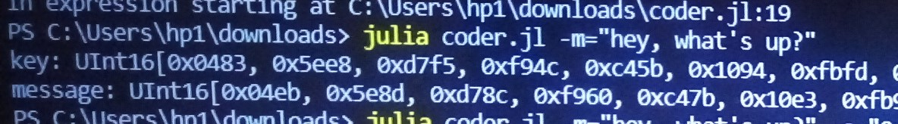
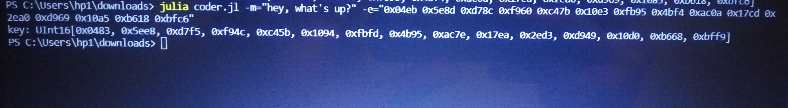

---
## Front matter
lang: ru-RU
title: Защита лабораторной работы №7. Однократное гаммирование
author: |
	Сырцов А.Ю. \inst{1}
institute: |
	\inst{1}RUDN University, Moscow, Russian Federation
	
date: 2022, 22 October, Moscow, Russia

## Formatting
toc: false
slide_level: 2
theme: metropolis
header-includes: 
 - \metroset{progressbar=frametitle,sectionpage=progressbar,numbering=fraction}
 - '\makeatletter'
 - '\beamer@ignorenonframefalse'
 - '\makeatother'
aspectratio: 43
section-titles: true
---

# Прагматика выполнения лабораторной работы

- Основное направление информационной безопасности - криптография
- Алгоритм однократного гаммирования прост в реализации, но достаточно стойкий
- Язык программирования Julia активно развивается во многих направлениях, поэтому его полезно применять и в криптографии.

# Цель выполнения лабораторной работы 

Освоить на практике применение режима однократного гаммирования.

# Задачи выполнения лабораторной работы

Нужно подобрать ключ, чтобы получить сообщение «С Новым Годом, друзья!». Требуется разработать приложение, позволяющее шифровать и дешифровать данные в режиме однократного гаммирования. Приложение должно:
1. Определить вид шифротекста при известном ключе и известном открытом тексте. 
2. Определить ключ, с помощью которого шифротекст может быть преобразован в некоторый фрагмент текста, представляющий собой один из возможных вариантов прочтения открытого текста.

# Идея алгоритма

Код считывает строковые значения аргументов `-m` или `--message` (исходное сообщение), `-e` или `--encoded_message` (шифр) и, если `-e` или `--encoded_message` задано, то программа высчитывает значение ключа. В обратном случае шифруется значение строки `-m` или `--message`.

# Результаты

Результат кодирования (рис. -@fig:001).

{ #fig:001 width=70% }

Результат нахождения ключа (рис. -@fig:002).

{ #fig:002 width=70% }

# Результат выполнения лабораторной работы

Удалось развить навыки администрирования ОС Linux.

